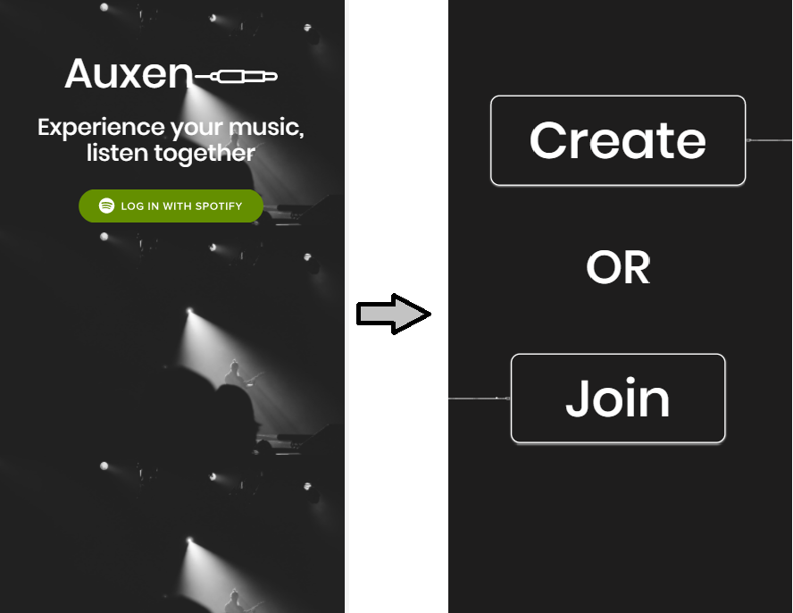
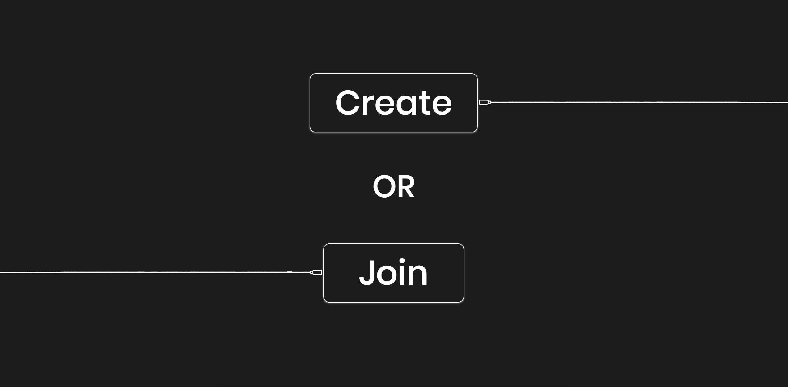

</img>

# Auxen - Experience your music better by listening together

## Product

### [Live Web Site](https://www.auxen.live/)

1. Auxen gives Spotify Premium users the ability to go live and project their music in real-time to a room which listeners can join. Whatever the "DJ" plays, the listener hears in real-time. The application emulates the experience of people listening in a room together.

2. Below you can find the flow and functionality of the application.

## Using the App

### Login Screen
</img>

### Home Screen

</img>

## API Reference

1. Communication with Spotify is based on Spotify web API

- https://developer.spotify.com/web-api/

## Contributors

Yash Navatia, Benjamin Segal , Mohamad Sayed

## License
  MIT license
