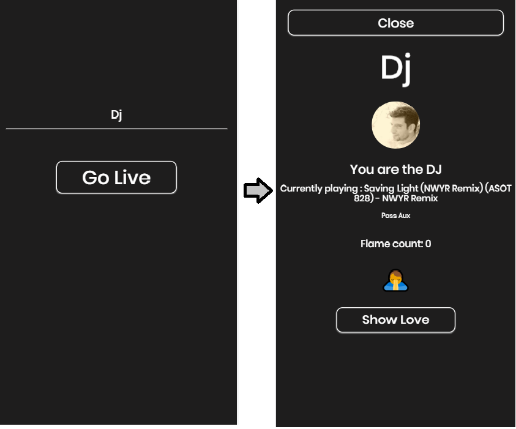
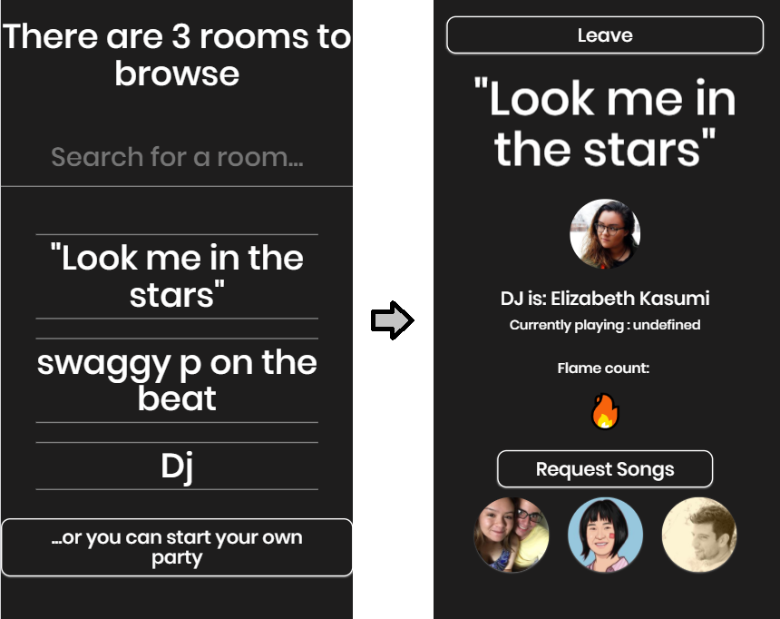

</img>

# Auxen - Build culture by sharing your music

## Product

### [Live Web Site](https://www.auxen.live/)

1. Auxen gives people the ability to hear what you are hearing on your local Spotify, you do not need to build complicated list or choose your music, just create a room and listen to what you live on your Spotify.
You can share gratitude to your Audience and see there responses. At the moment Auxen is most suitable for web browser but soon you will be able to use it

2. Here is the work flow of the system and some photos from a live Demo.

## Using the App

## Login screen
</img>

## Dj room view and user view room

</img>      </img>

## User room view

 

 
User room view 

 
 

## API Reference

1. Communication with Spotify is based on Spotify web API

- https://developer.spotify.com/web-api/

## Contributors

Yash Navatia, Benjamin Segal , Mohamad Sayed

## License
  MIT license
