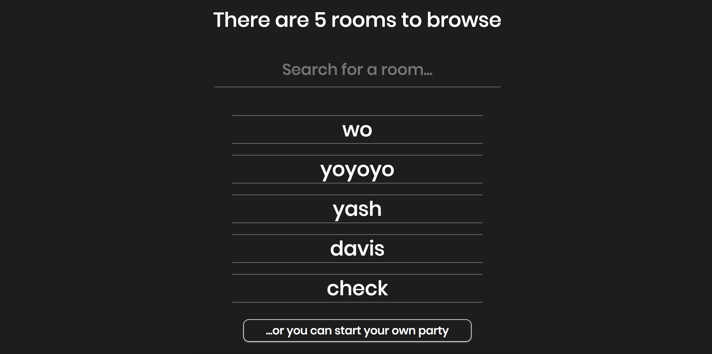

</img>

# Auxen - Experience your music better by listening together

### [Live Web Site](https://www.auxen.live/)

1. Auxen gives Spotify Premium users the ability to go live and project their music in real-time to a room which listeners can join. Whatever the "DJ" plays, the listener hears in real-time. The application emulates the experience of people listening in a room together.

2. Below you can find the flow and functionality of the application.

### Login Screen
</img>

On the login screen, users are prompted to log in with their Spotify Premium account.
### Home Screen

</img>

On the home screen, users can choose to either create a room or to join a room. 

### Create Room

</img>

The create room screen, is pretty simple. You just have to choose a unique name.

### Join Room

</img>

The join room screen allows you choose between the different rooms. 

### DJ Room View

</img>

The DJ room view is simple. Users who join the room spread out below.
The DJ can send floating 🙏 or send messages to all the room listeners.
Additionally, the DJ can "pass the Aux" to listeners in the room. The DJ can also take back the Aux whenever he or she pleases.

### Listener Room View

</img>

The User Room View is very similar to the DJ view, with a few key differences.
Like the DJ, the listener can send messages to the room, but instead of 🙏 there is 🔥. The listener can set the room on fire.

## API Reference

1. Communication with Spotify is based on Spotify web API

- https://developer.spotify.com/web-api/

## Contributors

[Yashvardhan Nevatia](https://github.com/yashnevatia), [Benjamin Segal](https://github.com/segalb) , [Mohammad Syed](https://github.com/mohammad-gitup)

## License
  MIT license
